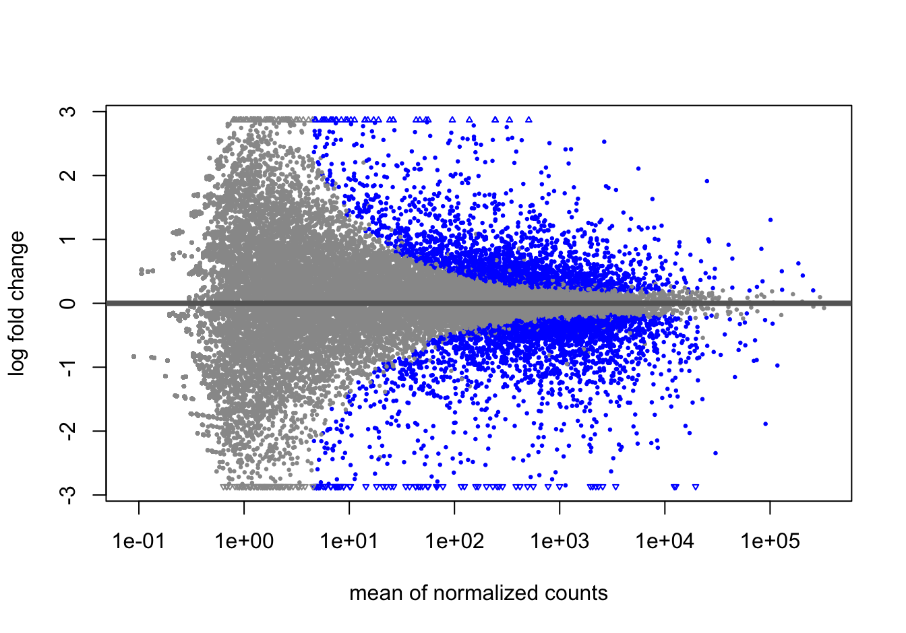
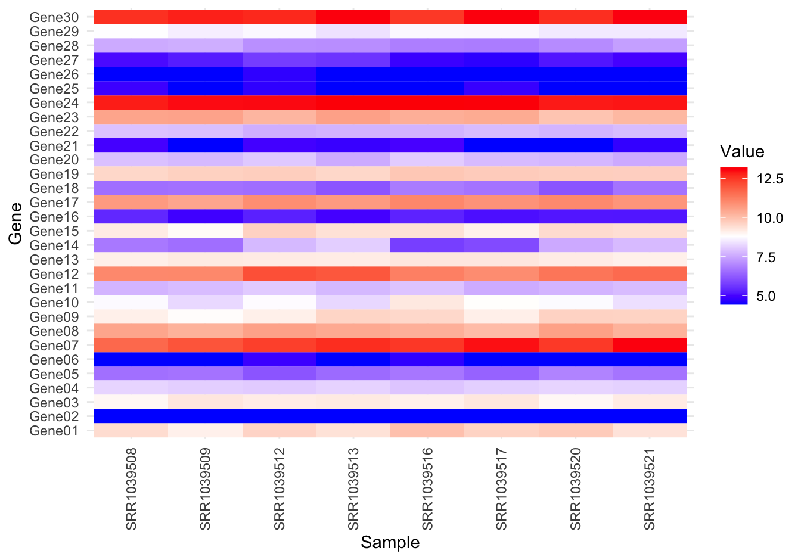

# (PART) BIOINFORMATICS TERMS {-}

# Omics Terminologies

Welcome to the Bioinformatics Dictionary, your comprehensive guide to the terminology and methodologies essential for understanding and conducting bioinformatics research. Encompassing a broad spectrum of terms from various 'omics' sciences, this dictionary offers concise definitions, practical R code demonstrations with illustrative examples, and interpretations of each term, providing valuable insights into the language of bioinformatics. Whether you're a seasoned bioinformatician, a researcher delving into molecular biology, a student preparing for an interview, or a job seeker aiming to enhance your bioinformatics skills, this resource serves as your go-to for deciphering the intricacies of biological data analysis.

From genomics and transcriptomics to proteomics, metabolomics, and beyond, each entry equips you with the knowledge needed to explore the molecular mechanisms driving biological systems. Delve into the depths of bioinformatics and uncover the secrets encoded within the genomes, transcripts, proteins, and metabolites that shape life as we know it.

<div class="infoicon">
<p><strong>Code Illustration Demo</strong></p>
<p>For user-friendly code illustrations, we provide examples for each
term. An example of an analysis code can be found in Section Refer
@ref(rnaseqanalysis), demonstrating RNA-Seq Data Analysis.</p>
</div>


## Term: DNA Sequence

### Definition

A DNA sequence is a string of nucleotides (adenine, cytosine, guanine, and thymine) arranged in a specific order, representing the genetic information of an organism.

### R Code Illustration:

```R
# Define a DNA sequence
dna_sequence <- Biostrings::DNAString("ATCGGCTAAGCCT")

```

### Interpretation

DNA sequences serve as the blueprint for the synthesis of RNA and proteins, playing a fundamental role in genetic inheritance, gene expression, and biological function.

## Term: RNA Sequence

### Definition

An RNA sequence is a string of nucleotides (adenine, cytosine, guanine, and uracil) arranged in a specific order, representing the sequence of RNA molecules transcribed from DNA.

### R Code Illustration:

```R
# Define an RNA sequence
rna_sequence <- Biostrings::RNAString("AUCGGCUAAGCCU")

```

### Interpretation

RNA sequences are transcribed from DNA and play diverse roles in gene expression, including messenger RNA (mRNA) for protein synthesis, transfer RNA (tRNA) for protein translation, and ribosomal RNA (rRNA) for ribosome function.

## Term: Nucleotide

### Definition

A nucleotide is the basic building block of nucleic acids (DNA and RNA), consisting of a nitrogenous base (adenine, cytosine, guanine, or thymine/uracil), a sugar (deoxyribose in DNA or ribose in RNA), and a phosphate group.

### R Code Illustration:

```R
# Define nucleotides
nucleotides <- Biostrings::nucleotideLetters()

```

### Interpretation

Nucleotides are essential units for storing and transmitting genetic information, forming the structural and functional basis of DNA and RNA molecules.

## Term: Open Reading Frame

### Definition

An open reading frame (ORF) is a sequence of nucleotide triplets (codons) in DNA or RNA that can be translated into a protein, starting with a start codon (usually AUG) and ending with a stop codon (UAA, UAG, or UGA).

### R Code Illustration:

```R
# Find open reading frames in a DNA sequence
orf <- Biostrings::findORF("ATG...TAA")

```

### Interpretation

Open reading frames represent potential protein-coding regions in DNA or RNA sequences and are crucial for predicting gene structure and function.

## Term: Glycomics

### Definition

Glycomics is the study of the structure, function, and biosynthesis of complex carbohydrates (glycans) in biological systems, elucidating their roles in cellular processes, disease mechanisms, and therapeutic targets.

### R Code Illustration:

```R
# Analyze glycomics data
glycomics_results <- glycoworkbench::glycomics_analysis(glycan_data)

```

### Interpretation

Glycomics investigates the diversity and complexity of glycans, providing insights into their interactions with proteins, cells, and pathogens, and their implications in health and disease.

## Term: Protein-Coding

### Definition

Protein-coding refers to regions of DNA or RNA sequences that contain the genetic information necessary for the synthesis of proteins through the process of transcription and translation.

### R Code Illustration:

```R
# Identify protein-coding genes in a genome
protein_coding_genes <- GenomicFeatures::protein_coding_genes(genome)

```

### Interpretation

Protein-coding genes encode messenger RNAs (mRNAs) that serve as templates for protein synthesis, contributing to the structural and functional diversity of proteins essential for cellular processes.

## Term: Non Protein-Coding

### Definition

Non-protein-coding regions of DNA or RNA sequences lack the capacity to encode proteins and may serve regulatory, structural, or functional roles in gene expression, RNA processing, and genome organization.

### R Code Illustration:

```R
# Identify non-protein-coding genes in a genome
non_protein_coding_genes <- GenomicFeatures::non_protein_coding_genes(genome)

```

### Interpretation

Non-protein-coding genes encompass a variety of RNA molecules, including transfer RNAs (tRNAs), ribosomal RNAs (rRNAs), microRNAs (miRNAs), and long non-coding RNAs (lncRNAs), contributing to cellular processes and regulatory networks.

## Term: Exon and Intron

### Definition

Exons are the coding regions of a gene that are transcribed into mRNA and ultimately translated into proteins, while introns are non-coding regions that are spliced out during mRNA processing, resulting in mature mRNA transcripts.

### R Code Illustration:

```R
# Identify exons and introns in a gene
exons <- GenomicFeatures::exons(gene)
introns <- GenomicFeatures::introns(gene)

```

### Interpretation

Exons contain the protein-coding sequences of genes, while introns are intervening sequences that are removed during mRNA maturation, contributing to gene regulation, alternative splicing, and genetic diversity.

## Term: Protein Sequence

### Definition

A protein sequence is a linear chain of amino acid residues encoded by a messenger RNA (mRNA) and synthesized during protein translation, representing the primary structure of a protein.

### R Code Illustration:

```R
# Define a protein sequence
protein_sequence <- Biostrings::AAString("MAEGGPAEFGSFDLK")

```

### Interpretation

Protein sequences determine the structure, function, and interactions of proteins, influencing cellular processes, biochemical pathways, and biological functions in living organisms.

## Term: Sequence Alignment

### Definition

Sequence alignment is the process of arranging two or more sequences (DNA, RNA, or protein) to identify similarities, differences, and evolutionary relationships, facilitating comparative analysis and functional annotation.

### R Code Illustration:

```R
# Perform sequence alignment
alignment <- Bioconductor::Biostrings::pairwiseAlignment(sequence1, sequence2)

```

### Interpretation

Sequence alignment enables the identification of conserved regions, mutations, and evolutionary changes in biological sequences, providing insights into sequence homology and functional conservation.

## Term: RNASeq Data Analysis {#rnaseqanalysis}

### Definition

RNASeq data analysis involves the processing, alignment, quantification, and differential expression analysis of RNA sequencing (RNASeq) data, elucidating gene expression patterns, transcript isoforms, and regulatory networks.

### R Code Illustration:
DESeq2 is a popular R package used for differential gene expression analysis, particularly with RNA-seq data. To demonstrate how to use the DESeq() function in DESeq2, you need count data for genes obtained from an RNA-seq experiment. Here's an example of what the count data might look like:


```r
# Load required libraries
library(DESeq2)
library(airway)

# Generate some example data
set.seed(42)
cnts <- matrix(rnbinom(n = 1000, mu = 100, size = 1 / 0.5), ncol = 10)
cond <- factor(rep(1:2, each = 5))

# Construct DESeqDataSet object
dds_object <- DESeqDataSetFromMatrix(cnts, DataFrame(cond), ~ cond)

# Perform DESeq2 analysis
dds <- DESeq(dds_object)
resLFC <- results(dds)

data("airway")

# Create DESeq2 object
dds <- DESeqDataSet(airway, design = ~ cell + dex)

# Perform DESeq2 analysis
dds <- DESeq(dds)
resLFC <- results(dds)
```


Here are some commonly used plots for differential expression analysis using DESeq2:

#### MA Plot
MA Plot: Visualizes the log-fold changes (M) versus the mean of normalized counts (A). This plot helps to identify genes that are differentially expressed between conditions.


```r
library(DESeq2)
library(airway)

data("airway")

# Create DESeq2 object
dds <- DESeqDataSet(airway, design = ~ cell + dex)

# Perform DESeq2 analysis
dds <- DESeq(dds)
resLFC <- results(dds)
plotMA(resLFC)
```




#### Volcano Plot
Volcano Plot: Shows the log2 fold change on the x-axis versus the statistical significance on the y-axis (e.g., -log10 p-value). This plot helps to identify significantly differentially expressed genes.


```r
library(DESeq2)
library(airway)

data("airway")

# Create DESeq2 object
dds <- DESeqDataSet(airway, design = ~ cell + dex)

# Perform DESeq2 analysis
dds <- DESeq(dds)
resLFC <- results(dds)

plotMA(resLFC, ylim = c(0, 20), main = "Volcano Plot")
```


#### Dispersion Plot
Illustrates the dispersion estimates for each gene as a function of the mean expression level. This plot helps to assess the appropriateness of the dispersion estimates.


```r
library(DESeq2)
library(airway)

data("airway")

# Create DESeq2 object
dds <- DESeqDataSet(airway, design = ~ cell + dex)

# Perform DESeq2 analysis
dds <- DESeq(dds)

# Dispersion Plot
plotDispEsts(dds)
```


#### Heatmap
Visualizes the expression profiles of differentially expressed genes across samples. This plot helps to identify clusters of samples or genes with similar expression patterns.


```r
library(DESeq2)
library(tidyr)
library(ggplot2)
library(airway)

data("airway")

# Create DESeq2 object
dds <- DESeqDataSet(airway, design = ~ cell + dex)

# Perform DESeq2 analysis
dds <- DESeq(dds)

# Perform size factor estimation and variance stabilizing transformation (VST)
vsd <- vst(dds)

# Extract normalized count data
norm_count_data <- assay(vsd)

# Define subset size
num_rows <- min(30, nrow(norm_count_data))  # Maximum of 50 genes
num_cols <- min(10, ncol(norm_count_data))   # Maximum of 20 columns

# Take a subset of the normalized count data
subset_norm_count_data <- norm_count_data[1:num_rows, 1:num_cols]

# # Create abbreviated row labels
abbrev_row_labels <- paste0("Gene", sprintf("%02d", seq_len(num_rows)))

# Reshape data into tidy format
subset_norm_count_data <- as.data.frame(subset_norm_count_data)
subset_norm_count_data$Gene <- abbrev_row_labels
subset_norm_count_data <- pivot_longer(subset_norm_count_data, -Gene, names_to = "Sample", values_to = "Value")

# Plot heatmap using ggplot2 and geom_tile()
ggplot(subset_norm_count_data, aes(x = Sample, y = Gene, fill = Value)) +
  geom_tile() +
  scale_fill_gradientn(colors = c("blue", "white", "red"), na.value = "grey") +
  theme_minimal() +
  theme(axis.text.x = element_text(angle = 90, vjust = 0.5, hjust=1))
```



PCA Plot: Shows the principal component analysis plot based on the top variable genes. This plot helps to visualize the overall sample clustering.


```r
# PCA Plot
library(DESeq2)
library(airway)

data("airway")

# Create DESeq2 object
dds <- DESeqDataSet(airway, design = ~ cell + dex)

# Perform DESeq2 analysis
dds <- DESeq(dds)

# Perform size factor estimation and variance stabilizing transformation (VST)
vsd <- vst(dds)
plotPCA(vsd, intgroup = "dex")
```


### Interpretation

RNASeq data analysis enables the comprehensive profiling of transcriptomes, identifying differentially expressed genes, alternative splicing events, and novel transcripts, and elucidating molecular mechanisms underlying biological processes and diseases.


## Term: Gene Expression

### Definition

Gene expression analysis involves the quantification, normalization, and differential analysis of transcript levels in biological samples, revealing dynamic changes in gene activity and regulatory networks under different conditions or treatments.

### R Code Illustration:

```R
# Analyze gene expression data
expression_results <- limma::lmFit(expression_data)

```

### Interpretation

Gene expression analysis provides insights into the transcriptional landscape of cells or tissues, identifying genes or pathways associated with biological processes, diseases, or experimental treatments.

## Term: Genome-Wide Association Study (GWAS)

### Definition

A Genome-Wide Association Study (GWAS) is a study design aimed at identifying genetic variants across the entire genome that are associated with a particular trait or phenotype, providing insights into the genetic basis of complex diseases and traits.

### R Code Illustration:

```R
# Perform GWAS analysis
gwas_results <- SNPassoc::GWAS(genotype_data, phenotype_data)

```

### Interpretation

GWAS allows researchers to uncover genetic loci influencing disease susceptibility, drug response, or other phenotypic traits, contributing to personalized medicine, risk prediction, and therapeutic target discovery.

## Term: Genome-wide association analysis (GWAA)

### Definition

Genome-wide association analysis (GWAA) refers to the statistical methods and analyses used to interpret the results of genome-wide association studies (GWAS), including quality control, single-variant association tests, and multiple testing corrections.

### R Code Illustration:

```R
# Perform GWAA analysis
gwaa_results <- SNPassoc::GWAA(genotype_data, phenotype_data)

```

### Interpretation

GWAA encompasses various statistical approaches to identify genetic variants significantly associated with traits of interest, controlling for confounding factors and correcting for multiple comparisons to minimize false-positive findings.

## Term: t-Distributed Stochastic Neighbor Embedding (tSNE)

### Definition

t-Distributed Stochastic Neighbor Embedding (tSNE) is a dimensionality reduction technique used for visualizing high-dimensional data in lower-dimensional space, preserving local structure and revealing clusters or patterns in complex datasets.

### R Code Illustration:

```R
# Perform tSNE analysis
tsne_results <- Rtsne::Rtsne(data_matrix)

```

### Interpretation

tSNE transforms high-dimensional data into a two- or three-dimensional representation, facilitating data exploration, clustering analysis, and visualization of similarities or differences between samples or data points.

## Term: Single-Cell Data Analysis

### Definition

Single-cell data analysis involves the processing, normalization, clustering, and visualization of gene expression profiles at the level of individual cells, enabling the characterization of cellular heterogeneity and identification of cell types or states.

### R Code Illustration:

```R
# Analyze single-cell data
single_cell_results <- Seurat::RunPCA(single_cell_data)

```

### Interpretation

Single-cell data analysis enables the investigation of cellular diversity, lineage trajectories, and regulatory networks within complex tissues or heterogeneous cell populations, advancing our understanding of development, disease, and cellular function.

If you have any further questions or need additional clarification, feel free to ask!


## Term: Proteomics Data Analysis

### Definition

Proteomics data analysis involves the processing, identification, quantification, and functional annotation of proteins and peptides in biological samples, elucidating protein expression patterns, post-translational modifications, and protein-protein interactions.

### R Code Illustration:

```R
# Analyze proteomics data
proteomics_results <- MSnbase::psmFilter(proteomics_data)

```

### Interpretation

Proteomics data analysis facilitates the characterization of the proteome, providing insights into protein function, cellular processes, and disease mechanisms, and guiding biomarker discovery and drug development efforts.

## Term: Epigenomics Data Analysis

### Definition

Epigenomics data analysis involves the investigation of epigenetic modifications, such as DNA methylation, histone modifications, and chromatin accessibility, across the genome, revealing regulatory mechanisms underlying gene expression and cellular phenotypes.

### R Code Illustration:

```R
# Analyze epigenomics data
epigenomics_results <- ChIPseeker::annotatePeak(epigenomics_data)

```

### Interpretation

Epigenomics data analysis enables the mapping of epigenetic landscapes, identifying regulatory elements, enhancers, and repressive regions in the genome, and elucidating their roles in development, disease, and environmental responses.

## Term: Variant Calling

### Definition

Variant calling is the process of identifying genetic variations, including single nucleotide polymorphisms (SNPs), insertions, deletions, and structural variants, from high-throughput sequencing data, facilitating the detection of disease-associated variants and population genetics studies.

### R Code Illustration:

```R
# Call variants from sequencing data
variant_calls <- VariantAnnotation::readVcf(sequencing_data)

```

### Interpretation

Variant calling identifies genomic differences between individuals or samples, providing insights into genetic diversity, evolutionary history, and disease susceptibility, and guiding precision medicine and personalized genomic medicine.

## Term: Metagenomics

### Definition

Metagenomics is the study of microbial communities in environmental samples or complex ecosystems by analyzing their collective genomic content, revealing microbial diversity, functional potential, and ecological interactions.

### R Code Illustration:

```R
# Analyze metagenomics data
metagenomics_results <- metagenomeSeq::fitTimeSeries(otu_table)

```

### Interpretation

Metagenomics enables the characterization of microbial communities, identifying novel species, predicting metabolic pathways, and assessing the impact of environmental factors on microbial ecology and ecosystem dynamics.

## Term: Transcriptomics

### Definition

Transcriptomics is the study of transcriptomes, including the complete set of RNA transcripts present in cells or tissues, elucidating gene expression patterns, alternative splicing events, and regulatory networks under different biological conditions.

### R Code Illustration:

```R
# Analyze transcriptomics data
transcriptomics_results <- tximport::tximport(transcriptomics_data)

```

### Interpretation

Transcriptomics provides insights into gene expression regulation, cellular responses to stimuli, and disease mechanisms, facilitating the discovery of biomarkers, drug targets, and therapeutic interventions.

## Term: Metabolomics

### Definition

Metabolomics is the comprehensive analysis of small molecules (metabolites) in biological samples, revealing metabolic pathways, biochemical signatures, and metabolic perturbations associated with physiological states, diseases, or environmental exposures.

### R Code Illustration:

```R
# Analyze metabolomics data
metabolomics_results <- xcms::xcmsSet(metabolomics_data)

```

### Interpretation

Metabolomics enables the identification and quantification of metabolites, providing insights into cellular metabolism, biomarker discovery, and personalized medicine approaches for disease diagnosis and treatment.

## Term: Pharmacogenomics

### Definition

Pharmacogenomics is the study of genetic variations underlying drug response and metabolism, integrating genomic information with pharmacological data to optimize drug selection, dosage, and efficacy for individual patients.

### R Code Illustration:

```R
# Analyze pharmacogenomics data
pharmacogenomics_results <- PharmacoGx::loadGEO(pharmacogenomics_data)

```

### Interpretation

Pharmacogenomics informs precision medicine strategies, predicting drug responses, adverse reactions, and treatment outcomes based on an individual's genetic profile, improving therapeutic efficacy and minimizing adverse drug reactions.

## Term: Chromatin Immunoprecipitation Sequencing (ChIP-Seq)

### Definition

Chromatin Immunoprecipitation Sequencing (ChIP-Seq) is a technique used to identify protein-DNA interactions, histone modifications, and transcription factor binding sites across the genome, revealing regulatory elements and chromatin states.

### R Code Illustration:

```R
# Analyze ChIP-Seq data
chip_seq_results <- csaw::readBamFile(chip_seq_data)

```

### Interpretation

ChIP-Seq provides genome-wide maps of protein-DNA interactions, elucidating gene regulatory networks, epigenetic modifications, and chromatin remodeling events critical for gene expression control and cellular differentiation.

## Term: Comparative Genomics

### Definition

Comparative genomics is the study of genomic similarities, differences, and evolutionary relationships among different species or closely related organisms, uncovering conserved genes, functional elements, and genomic rearrangements.

### R Code Illustration:

```R
# Perform comparative genomics analysis
comparative_genomics_results <- DECIPHER::AlignSeqs(genome1, genome2)

```

### Interpretation

Comparative genomics reveals evolutionary relationships, genetic adaptations, and genomic innovations shaping biodiversity and species


## Term: Functional Genomics

### Definition

Functional genomics investigates the functional elements and interactions within genomes, transcriptomes, and proteomes, deciphering gene functions, regulatory networks, and biological pathways underlying cellular processes and phenotypic traits.

### R Code Illustration:

```R
# Analyze functional genomics data
functional_genomics_results <- ReactomePA::enrichPathway(functional_genomics_data)

```

### Interpretation

Functional genomics integrates genomic, transcriptomic, and proteomic data to elucidate gene functions, biological processes, and molecular mechanisms, facilitating the discovery of therapeutic targets and biomarkers for diseases.

## Term: Variant Annotation

### Definition

Variant annotation is the process of annotating genetic variants with functional information, including genomic coordinates, allele frequencies, predicted effects on gene function, and disease associations, enhancing the interpretation of genetic variation in genomic studies.

### R Code Illustration:

```R
# Annotate variants with genomic features
annotated_variants <- VariantAnnotation::annovar(variants)

```

### Interpretation

Variant annotation provides context for genetic variants, linking them to known genes, biological pathways, and disease phenotypes, aiding in prioritizing variants for further investigation and understanding their implications in health and disease.

## Term: Population Genetics

### Definition

Population genetics is the study of genetic variation and evolutionary processes within populations, including allele frequencies, genetic drift, gene flow, and natural selection, elucidating patterns of genetic diversity and population structure.

### R Code Illustration:

```R
# Perform population genetics analysis
population_genetics_results <- poppr::hierfstat(population_data)

```

### Interpretation

Population genetics explores genetic variation within and between populations, shedding light on evolutionary mechanisms, adaptation to different environments, and the genetic basis of complex traits and diseases.

## Term: Transcriptome Analysis

### Definition

Transcriptome analysis involves the comprehensive study of RNA transcripts present in cells or tissues, including gene expression profiling, alternative splicing detection, and functional annotation, providing insights into cellular processes and regulatory networks.

### R Code Illustration:

```R
# Analyze transcriptome data
transcriptome_results <- tximport::tximport(transcriptome_data)

```

### Interpretation

Transcriptome analysis enables the quantification and characterization of RNA transcripts, uncovering gene expression patterns, regulatory mechanisms, and molecular pathways involved in development, disease, and cellular responses.

## Term: Homology

### Definition

Homology refers to the similarity in DNA, RNA, or protein sequences between different species that is due to inheritance from a common ancestor.

### R Code Illustration:

```R
# Calculate sequence similarity using BLAST
result <- blast(query_sequence, database)

```

### Interpretation

Homology analysis helps in understanding the evolutionary relationships between organisms by identifying conserved sequences across species. It is commonly used to infer functional and structural similarities between genes and proteins.

## Term: Molecular Evolution

### Definition

Molecular evolution is the study of how genes and proteins evolve over time at the molecular level, including changes in DNA sequence, gene duplication, and natural selection.

### R Code Illustration:

```R
# Phylogenetic tree construction
tree <- build_phylogenetic_tree(sequences)

```

### Interpretation

Molecular evolution provides insights into the mechanisms driving genetic diversity and adaptation within and between species, helping to understand evolutionary processes and patterns.

## Term: Phylogenetics

### Definition

Phylogenetics is the study of the evolutionary relationships between species or groups of organisms based on their genetic characteristics, often represented by a phylogenetic tree.

### R Code Illustration:

```R
# Construct a phylogenetic tree using maximum likelihood method
phylo_tree <- ape::phangorn(sequences, method = "ML")

```

### Interpretation

Phylogenetics allows scientists to reconstruct the evolutionary history of organisms, infer ancestral relationships, and study patterns of diversification and speciation.

## Term: Multiple Sequence Alignment

### Definition

Multiple sequence alignment is the process of aligning multiple sequences (DNA, RNA, or protein) to identify regions of similarity and divergence, providing insights into evolutionary relationships and functional domains.

### R Code Illustration:

```R
# Perform multiple sequence alignment using Clustal Omega
alignment <- clustalo(sequences)

```

### Interpretation

Multiple sequence alignment facilitates the comparison of sequences from different species or individuals, aiding in the identification of conserved regions, functional motifs, and evolutionary changes.

## Term: Hidden Markov Models (HMMs)

### Definition

Hidden Markov Models are statistical models used to represent sequences of observations, often applied in bioinformatics for tasks such as sequence alignment, gene prediction, and protein family classification.

### R Code Illustration:

```R
# Build a Hidden Markov Model for sequence analysis
model <- hmmlearn::HMM(n_states = 2, emission_prob = matrix(c(0.8, 0.2, 0.4, 0.6), byrow = TRUE))

```

### Interpretation

Hidden Markov Models are powerful tools for analyzing sequences with hidden states, allowing for probabilistic modeling of sequence data and prediction of biological features.

## Term: Structural Bioinformatics

### Definition

Structural bioinformatics involves the study of the three-dimensional structures of biological macromolecules, such as proteins and nucleic acids, and their interactions, often using computational methods to predict and analyze structures.

### R Code Illustration:

```R
# Predict protein structure using homology modeling
structure <- modeller::homology_model(template, target)

```

### Interpretation

Structural bioinformatics plays a crucial role in understanding protein function, drug discovery, and protein engineering by elucidating the relationships between structure and function at the molecular level.


## Term: Molecular Docking

### Definition

Molecular docking is a computational method used to predict the preferred orientation of one molecule (ligand) when bound to another molecule (receptor), typically a protein, to understand their interaction and potentially discover new drugs.

### R Code Illustration:

```R
# Perform molecular docking using Autodock Vina
docking_results <- autodock_vina(docking_parameters)

```

### Interpretation

Molecular docking helps in understanding the binding affinity and mode of interaction between molecules, aiding in rational drug design and optimization of therapeutic compounds.

## Term: Molecular Dynamics Simulation

### Definition

Molecular dynamics simulation is a computational technique used to study the movement and behavior of atoms and molecules over time, providing insights into the dynamics and energetics of biological systems.

### R Code Illustration:

```R
# Simulate molecular dynamics of a protein-ligand complex
simulation <- gromacs::md_simulation(system_parameters)

```

### Interpretation

Molecular dynamics simulations allow researchers to explore the conformational changes, stability, and interactions of biomolecules, contributing to our understanding of protein folding, drug binding, and enzymatic mechanisms.

## Term: Systems Biology

### Definition

Systems biology is an interdisciplinary field that integrates experimental and computational approaches to study complex biological systems as a whole, aiming to understand their structure, behavior, and emergent properties.

### R Code Illustration:

```R
# Construct a mathematical model of gene regulatory network
model <- systems_biology::network_model(data)

```

### Interpretation

Systems biology approaches enable the modeling and analysis of interactions within biological systems, offering insights into cellular processes, disease mechanisms, and potential therapeutic targets.

## Term: Network Analysis

### Definition

Network analysis involves the study of biological systems as networks of interconnected components, such as genes, proteins, or metabolites, to elucidate their structure, function, and dynamics.

### R Code Illustration:

```R
# Analyze gene regulatory network using network analysis tools
results <- igraph::network_analysis(network_data)

```

### Interpretation

Network analysis enables the characterization of complex biological networks, including gene regulatory networks, protein-protein interaction networks, and metabolic networks, providing insights into their organization and behavior.

## Term: Pathway Analysis

### Definition

Pathway analysis involves the systematic study of biological pathways, such as metabolic pathways or signaling pathways, to understand their role in cellular processes, disease mechanisms, and drug responses.

### R Code Illustration:

```R
# Perform pathway enrichment analysis using gene expression data
enrichment_results <- pathway_analysis(gene_expression_data)

```

### Interpretation

Pathway analysis helps in identifying dysregulated pathways associated with diseases, uncovering potential biomarkers and therapeutic targets, and guiding drug development and personalized medicine.

## Term: Gene Ontology (GO) Analysis

### Definition

Gene Ontology analysis is a bioinformatics approach used to annotate genes and proteins with functional terms from the Gene Ontology database, enabling the interpretation of high-throughput genomic data in terms of biological processes, molecular functions, and cellular components.

### R Code Illustration:

```R
# Perform GO enrichment analysis for a list of genes
enrichment_results <- topGO::go_analysis(gene_list)

```

### Interpretation

GO analysis helps in identifying overrepresented biological functions or pathways associated with a set of genes or proteins, facilitating the interpretation of experimental results and the discovery of functional relationships.


## Term: Protein-Protein Interaction (PPI) Analysis

### Definition

Protein-Protein Interaction (PPI) Analysis involves the study of physical interactions between proteins within cells, elucidating the structure, function, and dynamics of protein complexes and signaling networks.

### R Code Illustration:

```R
# Analyze protein-protein interactions using experimental data or predicted interactions
ppi_results <- ppi_analysis(interaction_data)

```

### Interpretation

PPI analysis aids in understanding cellular processes, disease mechanisms, and drug responses by identifying interacting protein pairs, uncovering functional modules, and elucidating the architecture of protein interaction networks.

## Term: Co-expression Analysis

### Definition

Co-expression analysis involves the identification and analysis of genes that exhibit similar expression patterns across multiple conditions or samples, providing insights into gene regulatory networks, biological pathways, and functional relationships.

### R Code Illustration:

```R
# Perform co-expression analysis using gene expression data
coexpression_results <- coexpression_analysis(expression_data)

```

### Interpretation

Co-expression analysis helps in uncovering co-regulated genes, inferring gene function, and predicting novel gene interactions, contributing to our understanding of cellular processes and disease mechanisms.

## Term: Chemo-informatics

### Definition

Chemo-informatics is the application of computational methods and techniques to analyze chemical data, including small molecules, drugs, and chemical compounds, to facilitate drug discovery, design, and optimization.

### R Code Illustration:

```R
# Predict chemical properties or activities using machine learning models
chemoinformatics_results <- chemoinformatics_analysis(chemical_data)

```

### Interpretation

Chemo-informatics plays a crucial role in drug discovery pipelines by predicting drug-target interactions, identifying lead compounds, and optimizing chemical structures to enhance therapeutic efficacy and safety.

## Term: Immunoinformatics

### Definition

Immunoinformatics is an interdisciplinary field that applies computational methods to analyze immune-related data, including antigen-antibody interactions, immune receptor sequences, and immunogenetic data, to advance vaccine design, immunotherapy, and understanding of immune system function.

### R Code Illustration:

```R
# Predict epitopes using sequence analysis tools
epitope_prediction <- immunoinformatics_tools::epitope_prediction(sequence_data)

```

### Interpretation

Immunoinformatics enables the prediction of immunogenic epitopes, identification of antigenic targets, and design of vaccines and immunotherapies tailored to specific pathogens or diseases.

## Term: Next-Generation Sequencing (NGS)

### Definition

Next-Generation Sequencing (NGS) refers to high-throughput sequencing technologies that enable the rapid and cost-effective sequencing of DNA or RNA molecules, revolutionizing genomics research, personalized medicine, and clinical diagnostics.

### R Code Illustration:

```R
# Analyze NGS data for variant calling, gene expression profiling, or metagenomic analysis
ngs_analysis <- bioconductor::ngs_pipeline(data)

```

### Interpretation

NGS technologies allow for the comprehensive analysis of genomic and transcriptomic landscapes, facilitating the discovery of genetic variants, gene expression profiling, and characterization of microbial communities.

## Term: De Novo Assembly

### Definition

De Novo Assembly is the computational process of reconstructing complete or partial genomes, transcriptomes, or other DNA/RNA sequences from short sequencing reads without a reference genome, often used for genome sequencing of non-model organisms or metagenomic studies.

### R Code Illustration:

```R
# Perform de novo assembly of short reads into contigs or scaffolds
assembly_results <- spades::de_novo_assembly(reads)

```

### Interpretation

De Novo Assembly enables the reconstruction of genomic sequences, transcript structures, and microbial genomes directly from sequencing data, facilitating genome annotation, comparative genomics, and discovery of novel genes or genetic elements.

## Term: Read Mapping

### Definition

Read Mapping is the process of aligning short sequencing reads to a reference genome, transcriptome, or other target sequences, enabling the identification of genetic variations, gene expression levels, and RNA splicing events.

### R Code Illustration:

```R
# Map sequencing reads to a reference genome using alignment algorithms
mapping_results <- bwa::read_mapping(reads, reference_genome)

```

### Interpretation

Read mapping allows for the accurate alignment of sequencing reads to a reference sequence, providing valuable information about genetic variations, gene expression profiles, and transcript structures.

## Term: Transcript Isoform Analysis

### Definition

Transcript Isoform Analysis involves the identification and characterization of alternative mRNA splicing events and transcript isoforms, providing insights into gene regulation, protein diversity, and disease mechanisms.

### R Code Illustration:

```R
# Analyze alternative splicing events and transcript isoforms using RNA-seq data
isoform_analysis <- cufflinks::transcript_isoform_analysis(rna_seq_data)

```

### Interpretation

Transcript isoform analysis helps in understanding the complexity of gene expression regulation, identifying novel splice variants, and elucidating the functional consequences of alternative splicing in development, health, and disease.


## Term: Gene Set Enrichment Analysis (GSEA)

### Definition

Gene Set Enrichment Analysis (GSEA) is a computational method used to determine whether a priori defined set of genes shows statistically significant differences between two biological states, such as phenotypes or experimental conditions, providing insights into biological pathways and processes.

### R Code Illustration:

```R
# Perform gene set enrichment analysis using gene expression data
enrichment_results <- fgsea::gsea_analysis(expression_data, gene_sets)

```

### Interpretation

GSEA helps in identifying biological pathways or gene sets that are significantly enriched or depleted under different experimental conditions, facilitating the interpretation of gene expression data and discovery of relevant biological processes.

## Term: Structural Variant Analysis

### Definition

Structural Variant Analysis involves the identification and characterization of large-scale genomic alterations, such as insertions, deletions, inversions, and translocations, providing insights into genetic diversity, evolution, and disease susceptibility.

### R Code Illustration:

```R
# Detect structural variants using sequencing data and bioinformatics tools
variant_analysis <- svtools::structural_variant_analysis(sequencing_data)

```

### Interpretation

Structural variant analysis helps in understanding the genetic basis of diseases, identifying potential disease-causing mutations, and elucidating the structural organization of the genome.

## Term: Copy Number Variation (CNV) Analysis

### Definition

Copy Number Variation (CNV) Analysis involves the detection and characterization of genomic regions with differences in copy number, providing insights into genetic diversity, population genetics, and disease susceptibility.

### R Code Illustration:

```R
# Analyze copy number variations using array-based or sequencing-based methods
cnv_analysis <- cnvtools::copy_number_variation_analysis(data)

```

### Interpretation

CNV analysis helps in identifying genomic regions associated with diseases, understanding their impact on gene dosage and expression, and exploring their role in evolutionary processes and genetic adaptation.

## Term: Genome Editing Analysis

### Definition

Genome Editing Analysis involves the characterization of targeted modifications made to the genome using genome editing technologies, such as CRISPR-Cas9, enabling precise genetic modifications, functional genomics studies, and therapeutic applications.

### R Code Illustration:

```R
# Analyze genome editing outcomes and off-target effects using sequencing data
editing_analysis <- crisprtools::genome_editing_analysis(sequencing_data)

```

### Interpretation

Genome editing analysis allows for the assessment of editing efficiency, specificity, and unintended off-target effects, facilitating the development of safer and more efficient genome editing strategies for research and therapeutic purposes.

## Term: Metabolite Identification

### Definition

Metabolite Identification involves the identification and annotation of small molecule metabolites present in biological samples, providing insights into metabolic pathways, biomarker discovery, and understanding of disease mechanisms.

### R Code Illustration:

```R
# Identify metabolites using mass spectrometry data and metabolomics databases
identification_results <- xcms::metabolite_identification(ms_data)

```

### Interpretation

Metabolite identification enables the characterization of metabolic profiles, identification of biomarkers for diseases or environmental exposures, and discovery of novel metabolites with potential biological significance.

## Term: Long Non-coding RNA (lncRNA) Analysis

### Definition

Long Non-coding RNA (lncRNA) Analysis involves the study of non-coding RNA molecules longer than 200 nucleotides, exploring their regulatory roles in gene expression, epigenetic regulation, and various cellular processes.

### R Code Illustration:

```R
# Analyze expression patterns and functional roles of lncRNAs using RNA-seq data
lncrna_analysis <- rtracklayer::lncrna_analysis(rna_seq_data)

```

### Interpretation

lncRNA analysis helps in understanding the functional significance of non-coding RNA molecules, elucidating their regulatory mechanisms, and identifying potential therapeutic targets for various diseases.

## Term: Small RNA Analysis

### Definition

Small RNA Analysis involves the characterization of short non-coding RNA molecules, such as microRNAs (miRNAs) and small interfering RNAs (siRNAs), elucidating their roles in post-transcriptional gene regulation, development, and disease.

### R Code Illustration:

```R
# Profile expression patterns of small RNAs using small RNA-seq data
small_rna_analysis <- shortread::small_rna_analysis(small_rna_seq_data)

```

### Interpretation

Small RNA analysis allows for the identification and quantification of small RNA species, deciphering their regulatory functions, and exploring their diagnostic and therapeutic potential in various biological processes and diseases.

## Term: Circular RNA (circRNA) Analysis

### Definition

Circular RNA (circRNA) Analysis involves the identification and characterization of circularized RNA molecules formed by back-splicing events, investigating their roles in gene regulation, cellular processes, and disease.

### R Code Illustration:

```R
# Detect and analyze circular RNA expression using RNA-seq data
circrna_analysis <- circexplorer::circrna_analysis(rna_seq_data)

```

### Interpretation

circRNA analysis helps in understanding the biogenesis, functions, and regulatory mechanisms of circular RNAs, offering insights into their potential as biomarkers and therapeutic targets in various diseases.

## Term: DNA Methylation Analysis

### Definition

DNA Methylation Analysis involves the study of DNA methylation patterns, where methyl groups are added to cytosine bases, regulating gene expression, chromatin structure, and epigenetic inheritance.

### R Code Illustration:

```R
# Analyze DNA methylation profiles using bisulfite sequencing data
methylation_analysis <- methylkit::dna_methylation_analysis(bisulfite_seq_data)

```

### Interpretation

DNA methylation analysis enables the characterization of epigenetic modifications, identification of differentially methylated regions, and understanding of their roles in development, aging, and diseases like cancer.

## Term: Histone Modification Analysis

### Definition

Histone Modification Analysis involves the study of post-translational modifications of histone proteins, such as acetylation, methylation, and phosphorylation, which regulate chromatin structure, gene expression, and cellular processes.

### R Code Illustration:

```R
# Analyze histone modification patterns using ChIP-seq data
histone_analysis <- csaw::histone_modification_analysis(chip_seq_data)

```

### Interpretation

Histone modification analysis helps in deciphering chromatin dynamics, identifying active and repressive chromatin states, and elucidating the functional consequences of histone modifications in gene regulation and disease.


## Term: Transcription Factor Binding Site (TFBS) Analysis

### Definition

Transcription Factor Binding Site (TFBS) Analysis involves the identification and characterization of short DNA sequences where transcription factors bind to regulate gene expression, playing a crucial role in gene regulatory networks and cellular processes.

### R Code Illustration:

```R
# Predict and analyze transcription factor binding sites using motif analysis tools
tfbs_analysis <- motifmatchr::tfbs_analysis(dna_sequence)

```

### Interpretation

TFBS analysis helps in understanding the regulatory mechanisms of gene expression, identifying cis-regulatory elements, and deciphering transcriptional regulatory networks underlying various biological processes and diseases.
