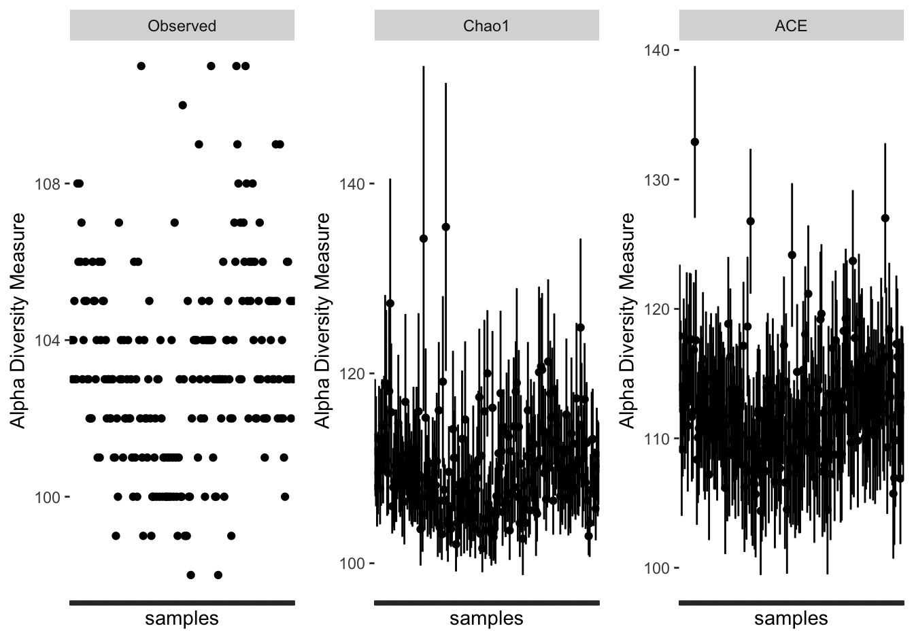
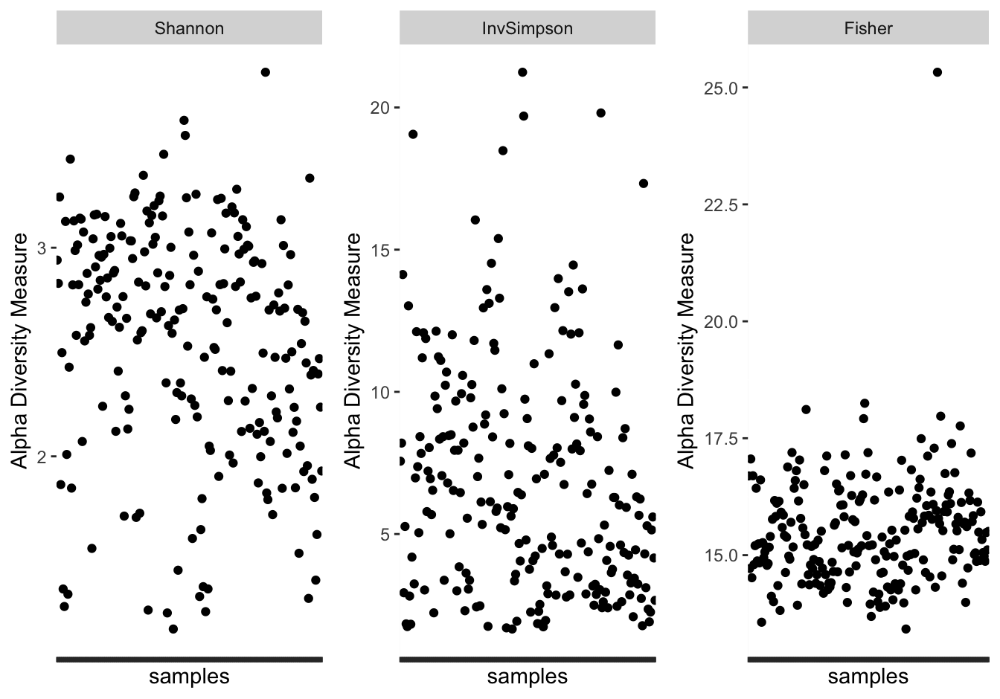

# Microbiome Terminologies 

## Term: Microbiome

### Definition
The microbiome refers to the community of microorganisms, including bacteria, viruses, fungi, and archaea, that inhabit a particular environment or organism. In the context of human health, the microbiome most commonly refers to the collection of microorganisms residing in and on the human body, particularly in the gut, skin, mouth, and other mucosal surfaces. These microbial communities play essential roles in various physiological processes, such as digestion, immune function, metabolism, and protection against pathogens.

```

### Interpretation
- The microbiome encompasses a diverse array of microorganisms, each contributing to the overall composition and function of the microbial community.
- Research on the human microbiome has revealed its significance in maintaining health and its potential implications for disease development and treatment.
- Advances in high-throughput sequencing technologies have enabled comprehensive profiling of microbial communities, leading to a better understanding of microbiome composition and dynamics.
- Studying the microbiome has broad implications for personalized medicine, nutrition, probiotics, and the development of novel therapeutic interventions targeting microbial dysbiosis.

## Term: Microbiome Data Analysis

### Definition
Microbiome data analysis involves the processing, analysis, and interpretation of sequencing data generated from microbial communities. It includes steps such as quality control, taxonomic classification, diversity estimation, functional annotation, and statistical analysis to gain insights into the structure and function of microbial communities.

```

### Interpretation
- Microbiome data analysis plays a crucial role in understanding the composition, diversity, and functional potential of microbial communities in various environments.
- By processing and analyzing sequencing data, researchers can uncover valuable insights into the interactions between microorganisms, their hosts, and their environments.
- Techniques such as taxonomic classification and diversity estimation help characterize the microbial community structure, while functional annotation provides insights into the metabolic capabilities and ecological roles of different microbial taxa.
- Statistical analysis allows for the identification of significant associations between microbial taxa and environmental factors or host phenotypes, contributing to our understanding of microbial ecology and its impact on human health, agriculture, and environmental sustainability.


## Term: Metagenomics Data Analysis
### Definition
Metagenomics data analysis is the computational examination of genetic material extracted directly from environmental samples, bypassing the need for culturing individual organisms. Its objective is to elucidate the genetic diversity, functional capabilities, and taxonomic structure of microbial communities across diverse ecosystems. This analytical process integrates various bioinformatics methodologies and tools for tasks including quality assurance, taxonomic classification, functional annotation, comparative assessments, and statistical modeling, thereby facilitating the extraction of valuable biological insights from metagenomic datasets..

### R Code Illustration:


```r
# This is a placeholder where you can add the R code illustration for metagenomics data analysis using an example dataset.
# Replace this comment with the actual R code illustration.

```


```

### Interpretation:
- Metagenomics data analysis enables the exploration of microbial communities in diverse environments, including soil, water, air, and the human body.
- Quality control ensures the removal of low-quality reads, sequencing artifacts, and contaminating sequences from metagenomic datasets, ensuring the reliability of downstream analyses.
- Taxonomic profiling assigns taxonomic labels to DNA sequences, allowing researchers to identify the microbial taxa present in the samples and assess their relative abundance.
- Functional annotation predicts the biological functions encoded by microbial genes, providing insights into the metabolic potential and ecological roles of microbial communities.
- Comparative analysis compares the abundance of microbial taxa or functional features between different conditions or sample groups, identifying differentially abundant taxa or functions associated with specific environmental factors or phenotypes.
- Statistical modeling employs statistical methods to identify associations, correlations, and patterns within metagenomic data, facilitating hypothesis testing and inference of biological relationships.


## Term: OTU Table

### Definition
An OTU (Operational Taxonomic Unit) table is a tabular data structure commonly used in microbiome research to represent the abundance or presence of different microbial taxa across multiple samples. Each row in the table typically represents a distinct taxonomic unit (e.g., species or genus), while each column represents a sample. The values in the table can denote various measures, such as raw read counts, relative abundances, or presence/absence indicators, depending on the specific analysis.

### R Code Illustration

```r
# Create sample names
sample_names <- paste0("Sample", 1:4)

# Create OTU table dataframe with row names
otutable <- data.frame(
  OTU1 = c(10, 20, 0, 40),
  OTU2 = c(15, 25, 35, 0),
  OTU3 = c(20, 0, 40, 50),
  OTU4 = c(25, 35, 0, 55),
  row.names = sample_names
)

# Print OTU table dataframe
otutable
        OTU1 OTU2 OTU3 OTU4
Sample1   10   15   20   25
Sample2   20   25    0   35
Sample3    0   35   40    0
Sample4   40    0   50   55
```


```

### Interpretation:
- OTU tables provide a quantitative or qualitative snapshot of microbial communities present in environmental or biological samples, such as soil, water, or human microbiome samples.
- These tables serve as the basis for downstream analyses, including alpha and beta diversity calculations, taxonomic profiling, and differential abundance testing.
- OTU tables facilitate comparisons between samples and enable researchers to identify patterns of microbial diversity, community structure, and ecological relationships.
- Preprocessing steps, such as quality filtering, normalization, and rarefaction, are often applied to OTU tables to mitigate biases and ensure robust downstream analysis outcomes.


## Term: Metadata

### Definition
Metadata refers to additional information or attributes associated with each sample in a biological dataset. In the context of microbiome research, metadata typically include details about the samples themselves, such as sample IDs, experimental conditions, sample collection methods, environmental parameters, and any other relevant annotations. Metadata provide crucial contextual information that helps researchers interpret and analyze microbiome data effectively.

### R Code Illustration


```r
# Create metadata dataframe
metadata <- data.frame(
  SampleID = paste0("Sample", 1:4),
  Condition = c("Control", "Treatment", "Control", "Treatment"),
  Timepoint = c(0, 1, 0, 1),
  pH = c(7.0, 6.5, 7.2, 6.8),
  Temperature = c(25, 26, 24, 27)
)

# Print metadata dataframe
metadata
  SampleID Condition Timepoint  pH Temperature
1  Sample1   Control         0 7.0          25
2  Sample2 Treatment         1 6.5          26
3  Sample3   Control         0 7.2          24
4  Sample4 Treatment         1 6.8          27
```


```

### Interpretation
- Metadata complement microbiome datasets by providing important contextual information about the samples, allowing researchers to understand the experimental design and conditions under which the data were generated.
- Common metadata categories include sample identifiers, experimental treatments, time points, geographical locations, host characteristics (if applicable), and sequencing platform details.
- Properly curated and annotated metadata are essential for reproducibility, transparency, and the ability to compare and integrate data across different studies or datasets.
- Metadata are often stored in tabular formats, separate from the OTU table or other data matrices, and are linked to the corresponding samples through unique identifiers.


## Term: Taxonomy

### Definition
Taxonomy refers to the classification and categorization of organisms into hierarchical groups based on their shared characteristics and evolutionary relationships. In microbiome research, taxonomy is commonly used to identify and classify microbial organisms present in a biological sample, such as bacteria, archaea, fungi, and viruses. Taxonomic classification is typically based on molecular markers, such as 16S rRNA gene sequences for bacteria and archaea, or internal transcribed spacer (ITS) sequences for fungi. The taxonomic hierarchy includes various ranks, such as kingdom, phylum, class, order, family, genus, and species, with each rank representing different levels of relatedness and similarity among organisms.

### R Code Illustration


```r
# Create taxonomy dataframe
taxonomy <- data.frame(
  OTU = paste0("OTU", 1:4),
  Kingdom = c("Bacteria", "Archaea", "Bacteria", "Bacteria"),
  Phylum = c("Firmicutes", "Euryarchaeota", "Proteobacteria", "Actinobacteria"),
  Class = c("Bacilli", "Thermoplasmata", "Alphaproteobacteria", "Actinobacteria"),
  Order = c("Bacillales", "E2", "Rhizobiales", "Micrococcales"),
  Family = c("Staphylococcaceae", "Euryarchaeota_incertae_sedis", "Rhizobiaceae", "Micrococcaceae"),
  Genus = c("Staphylococcus", "Unclassified", "Rhizobium", "Micrococcus"),
  Species = c("Staphylococcus aureus", "Unclassified", "Rhizobium leguminosarum", "Micrococcus luteus")
)

# Print taxonomy dataframe
taxonomy
   OTU  Kingdom         Phylum               Class         Order
1 OTU1 Bacteria     Firmicutes             Bacilli    Bacillales
2 OTU2  Archaea  Euryarchaeota      Thermoplasmata            E2
3 OTU3 Bacteria Proteobacteria Alphaproteobacteria   Rhizobiales
4 OTU4 Bacteria Actinobacteria      Actinobacteria Micrococcales
                        Family          Genus                 Species
1            Staphylococcaceae Staphylococcus   Staphylococcus aureus
2 Euryarchaeota_incertae_sedis   Unclassified            Unclassified
3                 Rhizobiaceae      Rhizobium Rhizobium leguminosarum
4               Micrococcaceae    Micrococcus      Micrococcus luteus
```


```

### Interpretation
- Taxonomy provides a systematic framework for organizing and naming organisms, facilitating the study of microbial diversity and evolution.
- Taxonomic classification allows researchers to identify and compare microbial communities across different samples or environments, helping to elucidate patterns of diversity and ecological relationships.
- Taxonomy plays a crucial role in microbiome analysis pipelines, where microbial taxa are identified and quantified based on sequencing data and reference databases.
- Advances in sequencing technologies and bioinformatics tools have enhanced our ability to characterize microbial taxonomy with greater accuracy and resolution, leading to improved understanding of microbial communities and their functional roles in various ecosystems.


## Term: Phyloseq Object

### Definition:
A phyloseq object is a data structure used in microbiome research for integrated analysis and visualization of microbial community data. It is typically generated and manipulated using the Phyloseq R package. A phyloseq object contains three main components:

1. **OTU Table:** This table represents the abundance or counts of operational taxonomic units (OTUs) or microbial taxa across different samples. Each row corresponds to a specific OTU, while each column represents a sample.

2. **Sample Data:** Sample data contains metadata associated with each sample, such as sample identifiers, treatment conditions, environmental factors, and other relevant information. It provides contextual information for interpreting the microbial community composition.

3. **Taxonomy Table:** The taxonomy table provides taxonomic assignments for the OTUs identified in the dataset. It includes the taxonomic ranks (e.g., kingdom, phylum, class, order, family, genus, species) assigned to each OTU based on reference databases and sequence similarity.


### R Code Illustration


```r
# Load required library
library(phyloseq)
library(tidyverse)

# Create OTU table dataframe
otutable <- data.frame(
  OTU = paste0("OTU", 1:4),
  Sample1 = c(10, 20, 0, 40),
  Sample2 = c(15, 25, 35, 0),
  Sample3 = c(20, 0, 40, 50),
  Sample4 = c(25, 35, 0, 55)
)

# Create metadata dataframe
metadata <- data.frame(
  SampleID = paste0("Sample", 1:4),
  Condition = c("Control", "Treatment", "Control", "Treatment"),
  Timepoint = c(0, 1, 0, 1),
  pH = c(7.0, 6.5, 7.2, 6.8),
  Temperature = c(25, 26, 24, 27)
)

# Create taxonomy dataframe
taxonomy <- data.frame(
  OTU = paste0("OTU", 1:4),
  Kingdom = c("Bacteria", "Archaea", "Bacteria", "Bacteria"),
  Phylum = c("Firmicutes", "Euryarchaeota", "Proteobacteria", "Actinobacteria"),
  Class = c("Bacilli", "Thermoplasmata", "Alphaproteobacteria", "Actinobacteria"),
  Order = c("Bacillales", "E2", "Rhizobiales", "Micrococcales"),
  Family = c("Staphylococcaceae", "Euryarchaeota_incertae_sedis", "Rhizobiaceae", "Micrococcaceae"),
  Genus = c("Staphylococcus", "Unclassified", "Rhizobium", "Micrococcus"),
  Species = c("Staphylococcus aureus", "Unclassified", "Rhizobium leguminosarum", "Micrococcus luteus")
)


# Ensure rownames match between OTU table and taxonomy
common_taxa <- intersect(rownames(otutable), rownames(taxonomy))
otutable <- otutable[common_taxa, ]
taxonomy <- taxonomy[common_taxa, ]

# Check taxa names in otutable and taxonomy
if (!identical(taxa_names(otutable), taxa_names(taxonomy))) {
  stop("Taxa/OTU names do not match between OTU table and taxonomy.")
}

# Convert OTU table dataframe to otu_table object
otutable <- otutable %>% 
  tibble::column_to_rownames("OTU") %>% 
  otu_table(otutable, taxa_are_rows = TRUE)

taxonomy <- taxonomy %>%
  tibble::column_to_rownames("OTU") %>%
  as.matrix() %>% 
  tax_table(taxonomy)

# Create phyloseq object
ps_raw_basic <- merge_phyloseq(metadata, otutable, taxonomy)


library(ape)
ps_tree = rtree(ntaxa(ps_raw_basic), rooted=TRUE, tip.label=taxa_names(ps_raw_basic))
ps_raw <- phyloseq::merge_phyloseq(ps_raw_basic, ps_tree)

ps_rel <- phyloseq::transform_sample_counts(ps_raw, function(x){x / sum(x)})

cat("Raw abundance phyloseq object\n")
Raw abundance phyloseq object
ps_raw
phyloseq-class experiment-level object
otu_table()   OTU Table:         [ 4 taxa and 4 samples ]
tax_table()   Taxonomy Table:    [ 4 taxa by 7 taxonomic ranks ]
phy_tree()    Phylogenetic Tree: [ 4 tips and 3 internal nodes ]

cat("\nRelative abundance phyloseq object\n") 

Relative abundance phyloseq object
ps_rel
phyloseq-class experiment-level object
otu_table()   OTU Table:         [ 4 taxa and 4 samples ]
tax_table()   Taxonomy Table:    [ 4 taxa by 7 taxonomic ranks ]
phy_tree()    Phylogenetic Tree: [ 4 tips and 3 internal nodes ]
```


```

### Interpretation
- Phyloseq objects serve as a comprehensive data structure for storing and analyzing microbiome data, integrating taxonomic abundance, sample metadata, and taxonomic classifications into a single entity.
- By encapsulating diverse types of microbiome data, phyloseq objects streamline data manipulation, statistical analysis, and visualization tasks in microbiome research workflows.
- The phyloseq package in R provides a wide range of functions and methods for creating, manipulating, and visualizing phyloseq objects, enabling researchers to perform exploratory data analysis, diversity analysis, differential abundance testing, and other microbiome-related analyses.
- Phyloseq objects facilitate reproducible research practices by encapsulating all necessary data and metadata within a single object, enhancing transparency and sharing of microbiome analysis workflows.


## Term: Alpha Diversity
### Definition
Alpha diversity is a measure of biodiversity that quantifies species diversity within a single sample or community. It assesses the richness and evenness of species present in a particular environment, providing insights into the diversity of microbial communities.


### R Code Illustration


```r
# Load required packages
library(microbiome)
library(phyloseq)
library(ggplot2)
library(ggpubr)

noticklabel <- theme(axis.text.x = element_blank())

# Read microbiome data, a phyloseq object of real-world dataset
data(dietswap)
microbiome_data <- dietswap

# Calculate alpha diversity indices

# Plot alpha diversity indices in a 3x2 grid
p1 <- plot_richness(microbiome_data, measures="Observed") + noticklabel
p2 <- plot_richness(microbiome_data, measures = "Chao1") + noticklabel
p3 <- plot_richness(microbiome_data, measures = "ACE") + noticklabel
p4 <- plot_richness(microbiome_data, measures = "Shannon") + noticklabel
p5 <- plot_richness(microbiome_data, measures = "InvSimpson") + noticklabel
p6 <- plot_richness(microbiome_data, measures = "Fisher") + noticklabel

ggarrange(p1, p2, p3, p4, p5, p6, ncol = 3)
$`1`
```



```

$`2`
```



```

attr(,"class")
[1] "list"      "ggarrange"
```

### Interpretation
- Alpha diversity provides information about the diversity of microbial species within a single sample or community.
- It considers both species richness (the number of different species) and species evenness (the distribution of abundance among species).
- Higher alpha diversity values indicate greater species richness and/or evenness, suggesting a more diverse microbial community.
- Alpha diversity metrics, such as Shannon diversity index, Simpson index, or observed species richness, are commonly used to quantify alpha diversity in microbiome studies.

