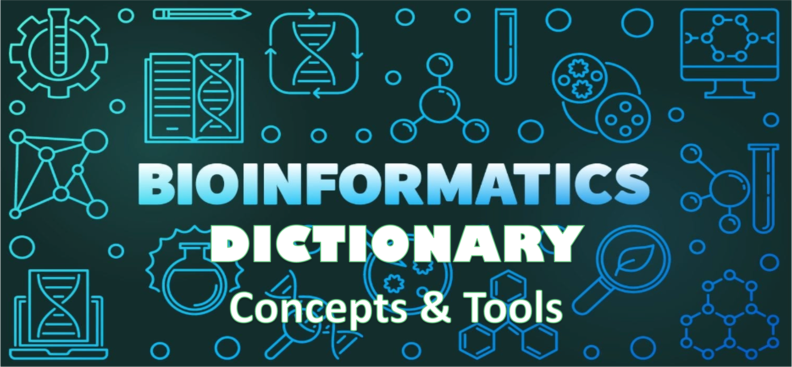

<!-- # Google fonts -->
<link rel="preconnect" href="https://fonts.googleapis.com">
<link rel="preconnect" href="https://fonts.gstatic.com" crossorigin>
<link href="https://fonts.googleapis.com/css2?family=Anton" rel="stylesheet">
<link href="https://fonts.googleapis.com/css2?family=Roboto:wght@100;300;400;500;700,900&display=swap" rel="stylesheet">
<link href="https://fonts.googleapis.com/css2?family=Oswald:wght@300;400;700&display=swap" rel="stylesheet">
<link href="https://fonts.googleapis.com/css2?family=Merriweather:wght@300;400;700&display=swap" rel="stylesheet">
<link href="https://fonts.googleapis.com/css2?family=Montserrat:wght@100;200;300;400;700&display=swap" rel="stylesheet">

<!-- # CSS -->
<link rel="stylesheet" href="https://cdnjs.cloudflare.com/ajax/libs/font-awesome/5.15.3/css/all.min.css">
<link rel="stylesheet" href="https://cdnjs.cloudflare.com/ajax/libs/animate.css/4.1.1/animate.min.css">


```{r lockfile, include=FALSE}
source("_common.R")
```

# Bioinformatics Dictionary: A Comprehensive Guide to Bioinformatic Concepts and Tools {-#bioinfo-dictionary}

<br>



<br>

## Introduction {-}

Welcome to the Bioinformatics Dictionary: A Comprehensive Resource for Students, Job Seekers, and Professionals!

This dictionary serves as a valuable reference for individuals navigating the vast and dynamic field of bioinformatics. Whether you're a student, job seeker, or seasoned professional, understanding the technical terms and concepts in bioinformatics is essential for success in research, academia, and industry.

Inside this dictionary, you'll find a comprehensive collection of key terms, definitions, and explanations covering various aspects of bioinformatics, including genomics, transcriptomics, proteomics, computational biology, and more. Whether you're deciphering research papers, preparing for interviews, or exploring new areas of study, this resource is designed to provide clarity and insight into the language of bioinformatics.

We hope this dictionary will be a valuable tool in your journey through the fascinating world of bioinformatics. Happy exploring!

